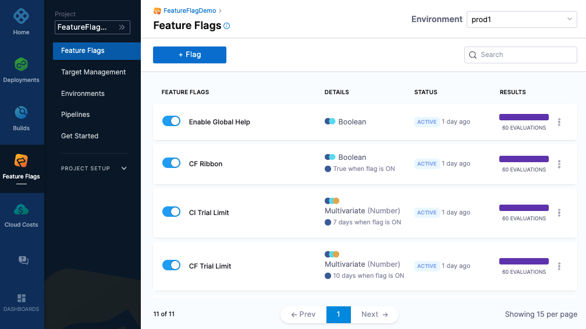

# ff-dotnet-wasm-client-sdk
FF .NET client SDK for [Blazor WebAssembly](https://dotnet.microsoft.com/en-us/apps/aspnet/web-apps/blazor)

# Intro
Use this README to get started with our Feature Flags (FF) Client SDK for .NET. This guide outlines the basics of getting started with the SDK and provides a full code sample for you to try out. This sample doesn’t include configuration options, for in depth steps and configuring the SDK, for example, disabling streaming or using our Relay Proxy, see the .NET SDK Reference.

`ff-dotnet-wasm-client-sdk` allows you to run a Feature Flags client inside a WebAssembly (Wasm) Virtual Machine on a browser. For a detailed overview of Wasm see [MDN web docs](https://developer.mozilla.org/en-US/docs/WebAssembly).
It supports polling, metrics and streaming via `Microsoft.AspNetCore.Components.WebAssembly.Http.HttpRequestMessage` and uses a non-threaded design based async/await C# methods and timers for compatibility with the limited .NET APIs available in the VM.





# Which SDK to use?

Harness Feature flags provide several .NET SDKs. Broadly speaking a client SDK serves one end user (or target) whereas a server SDK handles many targets.
A client SDK typically requires less CPU and network bandwith as they don't process rules locally, so are more suited to web browsers, phone and desktop apps.
Server SDKs are designed for server environments, since potentially sensitive rule config is pulled, the SDK API key should be treated as a backend secret and not exposed.

## ff-dotnet-wasm-client-sdk

This repository. This is a client SDK - it is designed to run client-side inside the web browser's WebAssembly Virtual Machine.
It imports some wasm specific modules for streaming support.

## ff-dotnet-client-sdk

This is a generic .NET C# client SDK designed for desktop and mobule apps via MAUI. See the [Github repository](https://github.com/harness/ff-dotnet-client-sdk)

## ff-dotnet-server-sdk

Our server side .NET C# server SDK, designed for server environments. See the [Github repository](https://github.com/harness/ff-dotnet-server-sdk)


## Requirements
The library is packaged as multi-target supporting  `net5.0`, `net6.0`, `net7.0`  and `net8.0`.

## Build Requirements
If building from source you will need [.Net 8.0.100](https://dotnet.microsoft.com/en-us/download/dotnet/8.0) or newer (dotnet --version)<br>


## Quickstart
To follow along with our test code sample, make sure you’ve:

- [Created a Feature Flag on the Harness Platform](https://ngdocs.harness.io/article/1j7pdkqh7j-create-a-feature-flag) called harnessappdemodarkmode
- [Created a server SDK key and made a copy of it](https://ngdocs.harness.io/article/1j7pdkqh7j-create-a-feature-flag#step_3_create_an_sdk_key)


### Install the SDK
Add the sdk using dotnet
```bash
dotnet add package ff-dotnet-wasm-client-sdk
```


# Getting started

Some sample applications are [provided](examples/) to help you test the SDK for the first time.
You will need to create a boolean flag called `harnessappdemodarkmode` and have a client API key for the SDK to authenticate. Edit `FeatureFlagsContext.cs` and add your client API to `_apiKey`.
Make sure you have the WASM workflows installed for your particular development environment. This is not described here but you can find more information from Microsoft at [Blazor WebAssembly build tools](https://learn.microsoft.com/en-us/aspnet/core/blazor/webassembly-build-tools-and-aot?view=aspnetcore-8.0).


### Running the example

The `dotnet watch` command will open up a browser:

```bash
cd examples/blazor-wasm
dotnet watch
```

Also, a small command line version has been provided. This runs from the console. To see full browser integration checkout the [Blazor WASM example](examples/blazor-wasm)

```bash
cd examples/getting-started
export FF_API_KEY=<your key here>
dotnet run
```


### Additional Reading


For further examples and config options, see the [Client SDK Reference](https://developer.harness.io/docs/category/client-sdk-guides).

For more information about Feature Flags, see our [Feature Flags documentation](https://ngdocs.harness.io/article/0a2u2ppp8s-getting-started-with-feature-flags).


-------------------------
[Harness](https://www.harness.io/) is a feature management platform that helps teams to build better software and to
test features quicker.

-------------------------


